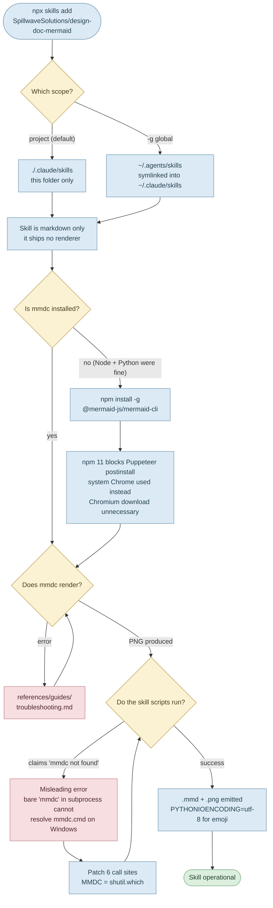
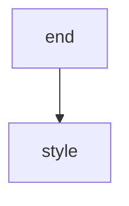

# Agent Skill Setup Notes

How the globally installed skills on this machine were set up, and the Windows- and editor-specific fixes needed to
make them actually work.

| Skill | Source | Scope | Engine it needs |
|-------|--------|-------|-----------------|
| [`design-doc-mermaid`](https://github.com/SpillwaveSolutions/design-doc-mermaid) | `SpillwaveSolutions/design-doc-mermaid` | global | Mermaid CLI, installed **globally** |
| [`slidev`](https://github.com/slidevjs/slidev) | `slidevjs/slidev` | global | `@slidev/cli`, installed **per project** |
| [`lab-to-deck`](#lab-to-deck) | written here | this folder | the Slidev toolchain above |

The two installed skills are global (`-g`) and available in every project. `lab-to-deck` was **written** in this
folder rather than installed, and deliberately stays here. Everything up to [Slidev](#slidev) concerns
`design-doc-mermaid`, which needed by far the most work.

Installed **2026-08-26** on Windows 11 (Node 26.3.1, npm 11.16.0, pnpm 11.24.0, Python 3.13.13).

---

## Install Workflow



> Rendered export: [`diagrams/readme_01_flowchart_install_workflow.png`](diagrams/readme_01_flowchart_install_workflow.png)
> (GitHub renders the fence above natively; the PNG is for Confluence, Word, or PDF targets.)

---

## What Was Actually Done

### 1. Install the skill globally

```bash
npx skills add SpillwaveSolutions/design-doc-mermaid -g -y -s design-doc-mermaid
```

`add` defaults to **project** scope (`./.claude/skills/`). The `-g` flag installs to user level instead, making it
available in every project. Files land in `~/.agents/skills/design-doc-mermaid` and are symlinked into
`~/.claude/skills/`. Pass `--copy` instead of symlinking if you plan to commit the skill into a repo.

Preview a repo's contents without installing: `npx skills add -l <owner>/<repo>`

### 2. Install the renderer

The skill is **instructions only** — it ships no rendering engine. Diagram validation and PNG/SVG export need the
Mermaid CLI:

```bash
npm install -g @mermaid-js/mermaid-cli
```

### 3. Fix the Windows issues

Two separate problems, both invisible from the install output. See below.

---

## Windows Gotchas

### `mmdc.cmd` is unreachable from Python — **required patch**

The skill's three Python scripts invoked the CLI by bare name:

```python
subprocess.run(['mmdc', '--version'], ...)   # always FileNotFoundError on Windows
```

npm installs the executable as `mmdc.cmd`, but `CreateProcess` only appends `.exe` — so the bare name never
resolves, no matter how correctly the CLI is installed. Worse, the scripts catch the `FileNotFoundError` and
report it as:

```
mmdc not found. Install with: npm install -g @mermaid-js/mermaid-cli
```

That message sends you reinstalling a package that is already present and working. **Confirm with `mmdc --version`
in a shell before believing it.**

The fix — added to all three scripts in `~/.agents/skills/design-doc-mermaid/scripts/`, replacing the bare name at
all six call sites:

```python
import shutil

# On Windows npm installs `mmdc.cmd`, which bare-name subprocess calls
# cannot find (CreateProcess only appends .exe).
MMDC = shutil.which('mmdc') or shutil.which('mmdc.cmd') or 'mmdc'
```

> ⚠️ **This patch lives in upstream files.** `npx skills update` (or a remove/re-add) overwrites it and the scripts
> break again with the same misleading message. Re-apply the constant rather than reinstalling anything.

### Emoji in diagrams crash `--stdin` — **use the env var**

Piping a diagram containing Unicode symbols into the scripts fails:

```
UnicodeEncodeError: 'utf-8' codec can't encode character '\udc8d': surrogates not allowed
```

Stdin is decoded with the cp1252 locale codec, mangling UTF-8 emoji bytes into surrogates. Prefix the command:

```bash
PYTHONIOENCODING=utf-8 python .../resilient_diagram.py --stdin ...
```

### Puppeteer's blocked postinstall — **harmless, ignore**

npm 11 blocks the postinstall script that downloads Chromium:

```
npm warn allow-scripts   puppeteer@25.9.0 (postinstall: node install.mjs)
```

This looks alarming but does not matter here — `mmdc` renders through an already-installed system Chrome. No
action needed. Only if rendering genuinely fails is `npx puppeteer browsers install chrome` worth running.

---

## VS Code Preview Rendering

VS Code 1.134 renders Mermaid fences in the built-in Markdown preview with no extension needed. That is a recent
addition — if a third-party Mermaid extension is still installed from before, both renderers claim the same fence
and the result is an **empty frame** instead of a diagram.

Here the culprit was `bierner.markdown-mermaid` (v1.32.1). Symptoms:

- Fences render correctly on GitHub but show blank in the local preview.
- The blankness looks content-dependent — emoji, parentheses, `classDef` blocks all seem suspicious — which sends
  you bisecting the diagram instead of looking at the editor.

The fix:

1. Uninstall the extension (Extensions view → `bierner.markdown-mermaid` → **Uninstall**).
2. **Reload the window**: `Ctrl+Shift+P` → *Developer: Reload Window*. Uninstalling alone is not enough — the old
   renderer stays live in the running preview process until the window restarts.

> 💡 This is independent of everything above. The Python patch fixes **CLI export** (`.png` / `.svg`); the extension
> conflict broke **preview only**. Source that refuses to preview can still export fine, and vice versa — easy to
> conflate when both simply look like "mermaid is broken".

Expect one leftover: Windows will not let VS Code delete a running extension's files, so
`~/.vscode/extensions/bierner.markdown-mermaid-1.32.1` (34 MB) survives the uninstall and is recorded in
`~/.vscode/extensions/.obsolete`. It is inert — deregistered from `extensions.json` — and is normally cleared on the
next full restart of VS Code.

---

## Usage

Generate a validated diagram plus PNG in one step (the skill's recommended path — it validates before writing, so
broken diagrams never reach your markdown):

```bash
PYTHONIOENCODING=utf-8 python ~/.agents/skills/design-doc-mermaid/scripts/resilient_diagram.py \
    --code "flowchart TD
    A[Ingest] --> B{Valid?}
    B -->|Yes| C[(Store)]
    B -->|No| D[Reject]" \
    --markdown-file design_doc --diagram-num 1 --title "pipeline" --format png --json
```

Output follows a fixed naming convention in `./diagrams/`:

```
<markdown_file>_<num>_<type>_<title>.mmd   # source
<markdown_file>_<num>_<type>_<title>.png   # export
```

Other scripts in the same directory:

| Script | Purpose |
|--------|---------|
| `resilient_diagram.py` | Generate + validate + export, with error recovery |
| `extract_mermaid.py` | Pull diagrams out of Markdown, validate, swap for image refs |
| `mermaid_to_image.py` | Convert `.mmd` to PNG/SVG, batch and themed |

Validate by hand without the scripts:

```bash
mmdc -i diagram.mmd -o diagram.png -b transparent
```

### Known false positive

The skill's validator flags Mermaid reserved words (`start`, `end`, `call`, `style`, `class`, `graph`) even when
they appear in display labels, where they are harmless. Quote the label to silence it:



---

## Slidev

The second skill, installed the same way:

```bash
npx skills add slidevjs/slidev -g -y -s slidev
```

Previewing first with `npx skills add -l slidevjs/slidev` shows the repo ships exactly one skill (`slidev`) — 55
markdown files, zero scripts.

### "Failed to install 1" is a false alarm

The installer fans out to every agent target it knows and ends with:

```
■  Failed to install 1
   ✗ slidev → PromptScript: PromptScript does not support global skill installation
```

That is PromptScript declining a global scope it does not implement, not a failure of the install. Claude Code got
it — confirm with `npx skills list -g`, which lists both skills.

### The engine is per-project — don't install it globally

Same shape as the mermaid skill (instructions only, ships no engine) but the fix is the opposite.
`design-doc-mermaid` needs a **global** `mmdc` because its Python scripts shell out to one by name. Slidev has no
scripts; decks are scaffolded with their own **local** `@slidev/cli`, so a global install would be the wrong shape:

```bash
pnpm create slidev      # scaffolds a deck with its own local @slidev/cli
pnpm install
pnpm run build          # static SPA into ./dist
pnpm run dev            # http://localhost:3030
```

`pnpm create slidev` is **interactive** — it needs a real terminal. It prompts for a project name, then offers
"Install and start it now using npm?" (it says npm even when launched through pnpm; answer no and run
`pnpm install` yourself to keep one lockfile format).

### Export needs a dependency the scaffold omits

`pnpm run export` fails on a fresh deck:

```
Error: The exporting for Slidev is powered by Playwright,
please install it via `npm i -D playwright-chromium`
```

This is not a broken install and nothing downloads automatically — `playwright-chromium` is simply not in the
generated `package.json`. Add it per deck:

```bash
pnpm add -D playwright-chromium
pnpm run export                      # -> slides-export.pdf
pnpm exec slidev export --format png # -> slides-export/1.png, 2.png, ...
```

The browser binaries live in `~/AppData/Local/ms-playwright/` and are shared across projects, so the first deck
pays the download and later ones do not. They were already cached here, which is why the add finished in 5s.
This is a different browser from the system Chrome that `mmdc` reuses.

### Corepack is gone in Node 26 — **pnpm needed installing**

`SKILL.md` opens with `pnpm create slidev`, and pnpm was not on this machine. The usual answer — `corepack enable
pnpm` — no longer applies: Node 26 stopped bundling Corepack, so `corepack` is itself `command not found`. Installed
globally instead, matching the mermaid CLI:

```bash
npm install -g pnpm
```

`npm create slidev@latest` scaffolds the same deck if you would rather not add pnpm at all.

### Verified end to end

Scaffold → install → build → serve → export, run on 2026-08-26:

| Step | Result |
|------|--------|
| `pnpm create slidev deck` | scaffolded (interactive; piped answers) |
| `pnpm install` | 693 packages, 14.8s |
| `pnpm run build` | ✓ built in 8.40s → `dist/` |
| `pnpm exec slidev --port 3031` | HTTP 200, `<title>Welcome to Slidev</title>` |
| `pnpm run export` | ✗ until `playwright-chromium` added, then 4.6 MB PDF |
| `slidev export --format png` | 16 slides, rendered correctly with theme + webfonts |

### Security rating

`skills.sh` reports Gen **Safe**, Socket **0 alerts**, Snyk **Med Risk**. It is a first-party repo from the Slidev
org containing no executable files, so nothing in it runs — but the installer's own advice stands: review a skill
before use, since skills run with full agent permissions. Details at <https://skills.sh/slidevjs/slidev>.

---

## lab-to-deck

The skill built in this folder — `./.claude/skills/lab-to-deck/SKILL.md`. It turns pasted course-lab text into a
Slidev deck and exports it as a PDF: the workflow documented above, written down so it never has to be
re-explained.

### Calling it

Paste the lab text and ask in your own words. The description is written to fire on exactly this:

```text
Here is the lab text for part 2 - turn it into a slide deck and export it as a PDF.

Lab: <paste the whole "Lab: ..." section here>
```

Other phrasings that hit the same description:

```text
Make me a PDF deck out of this module text.
Convert this assignment into slides.
```

Or name it explicitly with `/lab-to-deck`. Firing it by natural phrasing is the better test — if a normal request
misses, the description is too narrow and should be widened, rather than the request reworded to suit it.

### Cold-run verification

The description was tested twice from a **cleared session** — no `/lab-to-deck`, no mention of the word "skill",
just the lab text and a plain request. Both times the skill was invoked as the **first tool call**, three seconds
after the prompt landed:

| Run | Cleared | Prompt | Skill fired | Output |
|-----|---------|--------|-------------|--------|
| **Part 2** — *audit an earlier project for compliance* | 13:47:56 | 13:48:49 | 13:48:52, first tool call | 8-page PDF |
| **Part 3** — *build and preview a small mobile app* | 14:19:40 | 14:21:59 | 14:22:02, first tool call | 8-page PDF |

Both runs opened with the same sentence — the [Calling it](#calling-it) template pasted verbatim, with only the lab
text swapped underneath it:

```text
Here is the lab text for part 2 - turn it into a slide deck and export it as a PDF.
```

That is why both prompts read "part 2": the number belongs to the template, not to the lab beneath it. Firing on
two unrelated domains — a compliance audit and a mobile app — from identical phrasing is the evidence the
description is neither too narrow nor accidentally tuned to one lab. No widening needed.

**What each run exposed.** Neither was a silent pass; the point of a cold run is what it surfaces.

- **Part 2** fired correctly, but reviewing its output drove three patches back into the skill: one entry file per
  lab under `slides/` instead of overwriting `slides.md`, PDFs collected in `part1/`, and `preview` added to
  `.gitignore`. That lab also pointed at "the two regulations from this lesson" without including them — the
  missing prompt was written by parallel construction and labelled on the slide as **not quoted from the lab**,
  per the skill's rule for gaps in the source.
- **Part 3** ran clean on the patched skill. The only correction was layout: the baked-in Mermaid `{scale: 0.75}`
  clipped the last node's edge label on a six-node chart, and needed `0.61`. The Step 5 PNG check caught it before
  export — which is exactly the failure that rule exists to prevent, working as intended.

> The scale figure in [What it bakes in](#what-it-bakes-in) is a starting point, not a constant. Node count and
> edge-label length both push it down; verify by looking at the PNGs rather than trusting the number.

### What it produces

`<lab-slug>.pdf` in the current folder, plus a reusable `lab-deck/` workspace. Typical shape: a cover, a Mermaid
overview of the stages, context slides, one slide per Part carrying its `Access:` line and verbatim prompts, and a
closing checklist.

### What it bakes in

Each row is a mistake made once while building the first deck, now prevented:

| Baked-in rule | The failure it prevents |
|---------------|-------------------------|
| No `v-click`, no animations | Each click step becomes its own PDF page — 9 slides silently become 20+ |
| Mermaid `flowchart LR` at `{scale: 0.75}` with short labels | At default scale the last node is cut off the right edge |
| Verify by exporting PNGs and **looking** at them | A successful build proves nothing about layout |
| Reuse `lab-deck/` instead of scaffolding per lab | 7 labs x ~500 MB of `node_modules` is 3.5 GB |
| `pnpm add -D playwright-chromium` inside the deck | Export hard-fails; it is not part of the scaffold |
| Pipe an answer into `pnpm create slidev` | The scaffolder is interactive and hangs without a TTY |
| Never fetch `intra.turingcollege.com` | Auth-gated SPA — every path returns the same empty shell |

### Extraction rules

Keeps numbered steps, `Access:` preconditions, **verbatim prompts and commands**, selection criteria, and
reflection questions. Cuts rationale, motivation, explanations of tools that will not be used, and back-references.
The tiebreaker for a borderline line: *does the reader do something with it?*

### Scope

Project-level, not global. Skills resolve from the directory Claude Code was started in, so it fires when you open
`part1/` and is invisible from a sibling folder. `mv .claude ../` lifts it to `sprint4/` to cover all seven parts.

---

## Housekeeping

Where things live:

```
~/.agents/skills/design-doc-mermaid/   # skill files (patched)
~/.claude/skills/design-doc-mermaid    # symlink to the above
~/.agents/skills/slidev/               # skill files (upstream, untouched)
~/.claude/skills/slidev                # symlink to the above
~/AppData/Roaming/npm/mmdc.cmd         # Mermaid CLI shim
~/AppData/Roaming/npm/pnpm.cmd         # pnpm shim
./.claude/skills/lab-to-deck/          # skill written here (project scope)
./lab-deck/                            # reusable Slidev workspace (~494 MB)
./diagrams/                            # generated .mmd + image output
```

Useful commands:

```bash
npx skills list -g                            # confirm both are global
npx skills remove -g -s design-doc-mermaid    # uninstall a skill
npx skills remove -g -s slidev
npm uninstall -g @mermaid-js/mermaid-cli      # uninstall the mermaid renderer
npm uninstall -g pnpm
```
