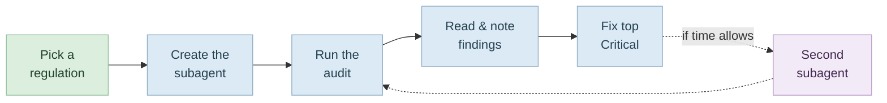

# Audit an Earlier Project for Compliance

Pick a regulation · build the subagent · run it · read the findings · fix the worst one

<div class="pt-12 opacity-60 text-sm">
Sprint 4 &nbsp;·&nbsp; budget ≈ 30–45 minutes
</div>

---

# The Arc



<div class="mt-6 text-sm opacity-70">
The subagent is <b>read-only</b>. It reports; you decide what to change.
</div>

---

# Choose the Regulation That Fits Your App

<div class="text-sm opacity-70 -mt-2 mb-6">
Access: Claude Code open in one of your earlier projects. Any app from an earlier sprint works. Any tier of Claude Code works.
</div>

<div class="grid grid-cols-2 gap-4 mt-6">

<div class="p-4 rounded bg-blue-400 bg-opacity-10">
<h3 class="!mt-0">GDPR</h3>
The app collects <b>personal data</b> — logins, profiles, anything tied to a real person.
<div class="mt-2 text-sm opacity-70">An app with user accounts suits this audit.</div>
</div>

<div class="p-4 rounded bg-amber-400 bg-opacity-10">
<h3 class="!mt-0">EU AI Act</h3>
The app has an <b>AI feature</b> — a chatbot, AI-generated content.
<div class="mt-2 text-sm opacity-70">An app with an AI feature suits this audit.</div>
</div>

</div>

<div class="mt-8 p-3 bg-gray-400 bg-opacity-10 rounded text-sm">
If the app has <b>both</b> — pick whichever interests you more.
</div>

---

# Part 1 · Create Your Compliance Subagent

<div class="text-sm opacity-70 -mt-2 mb-4">
Access: the earlier project, open in Claude Code. &nbsp;·&nbsp; GDPR path.
</div>

Create the matching subagent file in `.claude/agents/` by pasting the definition from the audit section. Add the file yourself, or ask the agent to do it.

**For the GDPR audit, for example:**

```text
Create a read-only compliance subagent in .claude/agents/ called
gdpr-compliance. It should check this app against GDPR: whether there is a clear
reason to hold each piece of personal data, whether users can get a copy of
their data and have it deleted, whether consent is handled properly, and whether
the privacy policy matches what the app actually collects. It must never change
anything, only report back a prioritised findings list, and end with a note that
this is a first-pass signal, not legal advice.
```

<div class="mt-4 p-3 bg-gray-400 bg-opacity-10 rounded text-sm">
Two non-negotiables in the definition: it <b>never changes anything</b>, and it ends with the note that this is a <b>first-pass signal, not legal advice</b>.
</div>

---

# Part 1 · The EU AI Act Variant

<div class="text-sm opacity-70 -mt-2 mb-4">
Same step, other path — use the definition from the audit section. The prompt below mirrors the GDPR one and is <b>not</b> quoted from the lab.
</div>

```text
Create a read-only compliance subagent in .claude/agents/ called
eu-ai-act-compliance. It should check this app against the EU AI Act: whether
users are told clearly when they are interacting with an AI, whether
AI-generated content is labelled as such, which risk category the AI feature
falls into, whether a person can review or override what the AI decides, and
whether there is any record of what the AI was asked and what it produced. It
must never change anything, only report back a prioritised findings list, and
end with a note that this is a first-pass signal, not legal advice.
```

<div class="mt-4 p-3 bg-gray-400 bg-opacity-10 rounded text-sm">
Everything downstream is identical — only the subagent name changes in the Step 1 prompt.
</div>

---

# Part 2 · Run the Audit — Steps 1–2

<div class="text-sm opacity-70 -mt-2 mb-4">
Access: same project, with the subagent file now in <code>.claude/agents/</code>.
</div>

**Step 1 — Run the subagent.** Point it at the project and read what comes back:

```text
Run the gdpr-compliance subagent on this app and give me the findings report,
grouped as Critical, Warning, and Suggestion.
```

**Step 2 — Read and note the findings.** Skim the report and note what it flagged.

<div class="mt-6 p-3 bg-red-400 bg-opacity-10 rounded text-sm">
<b>Critical</b> items are the ones that would stop you shipping to real users.
</div>

---

# Part 2 · Run the Audit — Steps 3–4

<div class="text-sm opacity-70 -mt-2 mb-4">
Access: same project, findings report in hand.
</div>

**Step 3 — Fix the top Critical finding** (if there is one). Pick the most serious finding and describe the fix you want in **plain language**, letting the agent make the change.

For example:

```text
The audit flagged that users have no way to delete their account and data.
Add a "Delete my account" option for logged-in users that really removes the
user and everything tied to them.
```

**Step 4 — If time allows: build the second subagent too.** Create the other subagent from its definition in the audit section, run it on the same project, and read that report as well.

---
layout: center
class: text-center
---

# Done When

<div class="text-left inline-block mt-4 leading-relaxed">

☐ &nbsp;You picked the regulation that fits your app<br>
☐ &nbsp;A read-only subagent exists in `.claude/agents/`<br>
☐ &nbsp;You have a findings report grouped Critical / Warning / Suggestion<br>
☐ &nbsp;You noted what it flagged, and which items would block shipping<br>
☐ &nbsp;The top Critical finding is fixed<br>
☐ &nbsp;<span class="opacity-60">(optional)</span> The second subagent ran on the same project<br>

</div>

<div class="mt-12 opacity-60 text-sm">
A first-pass signal, not legal advice.
</div>
