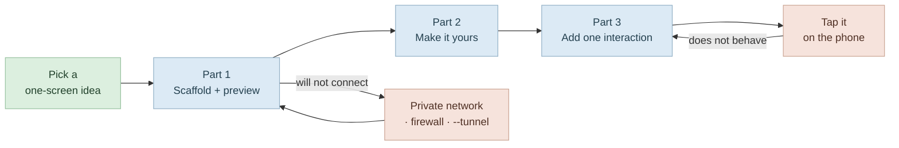

# Build and Preview a Small Mobile App

Scaffold · preview on your phone · make it yours · add one interaction

<div class="pt-12 opacity-60 text-sm">
Sprint 4 — Part 2 &nbsp;·&nbsp; budget ≈ 1–2 hours
</div>

---

# The Arc



<div class="mt-6 text-sm opacity-70">
The point is to complete the full loop — nothing to running on your own phone — not to build something ambitious.
</div>

---

# Before You Start

<div class="text-sm opacity-70 -mt-2 mb-4">
Access: Claude Code open in an <b>empty</b> project folder.
</div>

**You need:**

- Node.js and npm installed (any recent version)
- The **Expo Go** app installed on your phone — App Store or Google Play, free
- Your phone and computer on the **same Wi-Fi network**

<div class="mt-8 p-3 bg-gray-400 bg-opacity-10 rounded text-sm">
<b>Reflection</b> — before you scaffold anything, decide on a single-screen app idea simple enough to finish in one sitting.
A tip-of-the-day screen, a list of your five favourite films, a "roll a dice" button, a countdown to a date you care about.
<b>Keep it to one screen.</b>
</div>

---

# Part 1 · Scaffold

<div class="text-sm opacity-70 -mt-2 mb-4">
Access: Claude Code open in your empty project folder.
</div>

**Step 1 — Install the Expo agent skills.** First, give Claude Code current Expo context. Inside Claude Code, run:

```text
/plugin install expo@claude-plugins-official
```

The plugin installs **globally** — if you already ran it earlier in the lesson, it is still active. Move straight to Step 2.

**Step 2 — Scaffold the app.** Run it yourself, or ask the agent to — either produces the same working starter:

```bash
npx create-expo-app@latest
```

Or paste this prompt:

```text
Set up a new Expo mobile app in this folder using the standard starter
template. Use the Expo skills to get the current, accurate context for
building it. I want a working starter app I can preview on my phone.
```

---

# Part 1 · Preview on Your Phone

<div class="text-sm opacity-70 -mt-2 mb-4">
Access: the new project folder, scaffolded in Step 2.
</div>

**Step 3 — Start the dev server.** From inside the new project folder:

```bash
npx expo start
```

A QR code appears in the terminal.

**Step 4 — Open it on your phone.** On **iPhone**, scan the QR code with the Camera app. On **Android**, scan it inside the Expo Go app.

<div class="mt-6 p-3 bg-amber-400 bg-opacity-10 rounded text-sm">
<b>If it will not connect</b> — set your Windows network to <b>Private</b>, allow <b>Node.js</b> through the firewall, and if all else fails run <code>npx expo start --tunnel</code> and scan the new code.
</div>

<div class="mt-6 pl-4 border-l-4 border-green-500 text-sm">
<b>Success check</b> — the starter app opens on your phone and you can see its home screen.
</div>

---

# Part 2 · Make It Your Own

<div class="text-sm opacity-70 -mt-2 mb-4">
Access: same session, dev server still running, app open on your phone.
</div>

**Step 5 — Replace the starter content with your idea.** Describe the screen you decided on. Keep the prompt about **behaviour and appearance, not files**:

```text
Change the home screen to show my five favourite films as a clean, readable
list. Give it a title at the top that says "My Top Five" and a calm
background colour.
```

Watch your phone as the agent works — the screen should update on its own within a second or two of the change landing.

**Step 6 — Refine the look.** Ask for one or two adjustments in plain language until it looks the way you want:

```text
Make the film titles larger and add a bit more space between each one so it
is easier to read on a phone.
```

<div class="mt-4 pl-4 border-l-4 border-green-500 text-sm">
<b>Success check</b> — your phone shows your own content, styled roughly the way you asked, with no red error screen.
</div>

---

# Part 3 · Add One Interaction

<div class="text-sm opacity-70 -mt-2 mb-4">
Access: same session, app still live on your phone.
</div>

**Step 7 — Add a single tappable element.** Give the screen one thing the user can do. Describe the **behaviour, not the mechanism**:

```text
Add a button below my list that, when I tap it, shows a different one of my
films picked at random, with a short "tonight's pick" label above it.
```

**Step 8 — Test it on the phone.** Tap the button several times and confirm the behaviour changes each time. If it does not behave as expected, tell the agent what you see:

```text
When I tap the button nothing changes on my phone. It should pick a different
film each time. Fix it.
```

<div class="mt-4 pl-4 border-l-4 border-green-500 text-sm">
<b>Success check</b> — tapping the button produces the behaviour you described, and the app still runs without errors.
</div>

---
layout: center
class: text-center
---

# Done When

<div class="text-left inline-block mt-4 leading-relaxed">

☐ &nbsp;You picked a one-screen idea you can finish in one sitting<br>
☐ &nbsp;The Expo plugin is installed and a starter app is scaffolded<br>
☐ &nbsp;The starter app opened on your own phone<br>
☐ &nbsp;The home screen shows <b>your</b> content, styled the way you asked<br>
☐ &nbsp;One tappable element works on the phone, with no red error screen<br>

</div>

<div class="mt-12 opacity-60 text-sm">
Describe behaviour and appearance — not files, not mechanisms.
</div>
