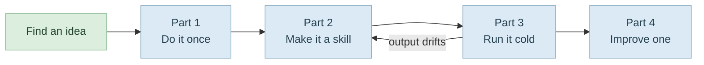

# Build Your Own Automation Skill

Find a chore · do it once · make it a skill · prove it cold · improve it

<div class="pt-12 opacity-60 text-sm">
Sprint 4 — Automations with Claude Code &nbsp;·&nbsp; budget ≈ 2 hours
</div>

---

# The Arc



<div class="mt-6 text-sm opacity-70">
If the cold run drifts, the gap is in the skill's written instructions — go back and fix the skill, not the output.
</div>

---

# Find Your Automation Idea

Browse the **n8n workflow library** as an idea source only — you will not use n8n itself.

1. **Browse the gallery.** Scan categories (AI, Sales, Marketing, Support…) for a chore you recognise from your own week.
2. **Pick one you would actually run** — not the most impressive one.
3. **Re-imagine it as a Claude Code skill.** Ignore n8n's node mechanics and ask:

<div class="mt-2 mb-4 pl-4 border-l-4 border-teal-500 italic">
"What would I ask Claude Code to do to get this result?"
</div>

<div class="mt-8 p-3 bg-gray-400 bg-opacity-10 rounded text-sm">
<b>Reflection</b> — before starting, name the chore in your own words and the trigger that would make you want it done
("every Friday afternoon", "every time I merge a pull request").
</div>

---

# Check Your Idea Against Three Things

<div class="grid grid-cols-3 gap-4 mt-8">

<div class="p-4 rounded bg-blue-400 bg-opacity-10">
<h3 class="!mt-0">Reachable</h3>
Claude Code can do it from the terminal: reading, writing and transforming text and files; browser automation; or a connected MCP tool such as Gmail or Calendar.
<div class="mt-2 text-sm opacity-70">If it needs something Claude Code cannot reach — pick another.</div>
</div>

<div class="p-4 rounded bg-amber-400 bg-opacity-10">
<h3 class="!mt-0">One sitting</h3>
A single, well-defined chore — not a sprawling multi-stage pipeline.
</div>

<div class="p-4 rounded bg-green-400 bg-opacity-10">
<h3 class="!mt-0">Outcome, not workflow</h3>
Describe what you want to happen and let the agent work out how.
</div>

</div>

<div class="mt-10 text-sm">

**Worked examples** — a *weekly report* workflow becomes a skill that reads your recent git log and open GitHub issues, then writes a Markdown summary. A *document summariser* becomes a skill that grades or condenses a document against a rubric you define.

</div>

---

# Part 1 · Do the Task Once

<div class="text-sm opacity-70 -mt-2 mb-4">
Access: Claude Code open in your project. No skill yet — just a single prompt.
</div>

Get the output right **before** you automate. A skill built on a shaky one-off repeats the shakiness.

**Step 1 — Write the one-off prompt.** Plain, behaviour-first language:

```text
Read my git history from the last seven days and the open issues on this
repository, then write me a one-page Markdown status report: what got done
this week grouped sensibly, what is still open and looks important, and
anything that seems stuck. Write it for a manager who does not read code.
```

**Step 2 — Review and refine.** Tell the agent what to change — grouping, length, tone — until you would actually use it.

**Step 3 — Note what made it good.** Track every adjustment. Those corrections are what the skill must bake in.

<div class="mt-4 p-3 bg-gray-400 bg-opacity-10 rounded text-sm">
<b>Reflection</b> — how many rounds of correction did it take to reach something you would send to someone?
</div>

---

# Part 2 · Turn It Into a Skill

<div class="text-sm opacity-70 -mt-2 mb-4">
Access: same session, immediately after a one-off result you are happy with.
</div>

You describe it; the agent writes the `SKILL.md` and the folder around it.

**Step 4 — Ask for the skill.** Reference the task and the refinements you just made:

```text
Turn what we just did into a reusable skill. It should produce the same kind
of status report, in the same format and tone, whenever I ask for one. Bake in
the adjustments we made: the grouping, the one-page length, and writing it for
a non-technical manager. Give the skill a clear description so you know to use
it whenever I ask for a status report.
```

**Step 5 — Skim it for obvious mistakes.** Ask to see the `SKILL.md`. You need not read every line — check that the **description matches when you would want it to fire**, and that the instructions capture your refinements. Ask it to widen or narrow the description if needed.

<div class="mt-4 p-3 bg-gray-400 bg-opacity-10 rounded text-sm">
<b>Reflection</b> — the description decides when the agent uses the skill. Specific enough to fire at the right moment, but not so narrow a slightly different request misses it?
</div>

---

# Part 3 · Run the Skill Fresh

<div class="text-sm opacity-70 -mt-2 mb-4">
Access: a <b>clean</b> Claude Code session in the same project — new conversation or <code>/clear</code>, so nothing from Parts 1–2 is still in context.
</div>

The real test of a skill is whether it works without the conversation that built it.

**Step 6 — Trigger it from a cold start.** Ask the way you naturally would:

```text
Give me this week's status report.
```

**Step 7 — Confirm it fired and the output holds up.** Check the agent used your skill — it will say so, or ask *"did you use my status-report skill?"* — and that the result matches Part 1 quality **without you re-explaining the format**.

**Step 8 — Fix the skill, not the output.** If the result drifts, do not just correct this one run. Ask the agent to update the skill so the fix sticks.

<div class="mt-4 p-3 bg-gray-400 bg-opacity-10 rounded text-sm">
<b>Reflection</b> — did the cold-start run match Part 1? If not, the gap is in the skill's written instructions, not in the agent. That gap is the difference between a one-off and a real automation.
</div>

---

# Part 4 · Improve the Skill

<div class="text-sm opacity-70 -mt-2 mb-4">
Access: same project, with the skill from Parts 1–3 in place. No new setup.
</div>

**Step 9 — Ask for improvement suggestions.**

```text
Read my status-report skill and suggest three to five ways it could be
improved: things it gets wrong, refinements I keep asking for by hand, or
checks it could do itself. For each, give me one sentence on what would change.
```

**Step 10 — Pick exactly one.** Choose the change that would most improve a report you would actually send. Ask the agent to make **only** that change and leave the rest alone.

**Step 11 — Re-run and check nothing else broke.** Fresh session again, ask for the report as normal, and confirm two things: the improvement is there, **and** everything that worked in Part 3 still works.

<div class="mt-4 p-3 bg-gray-400 bg-opacity-10 rounded text-sm">
<b>Reflection</b> — one change at a time lets you point to exactly what got better and what it disturbed. Bundle five changes and a worse result leaves you guessing which one caused it.
</div>

---
layout: center
class: text-center
---

# Done When

<div class="text-left inline-block mt-4 leading-relaxed">

☐ &nbsp;You named a chore and its trigger<br>
☐ &nbsp;The one-off output is something you would actually send<br>
☐ &nbsp;A `SKILL.md` exists, with a description that fires at the right moment<br>
☐ &nbsp;A cold session produced the same quality with no re-explaining<br>
☐ &nbsp;One improvement landed, and Part 3 still works<br>

</div>

<div class="mt-12 opacity-60 text-sm">
Fix the skill, not the output.
</div>
