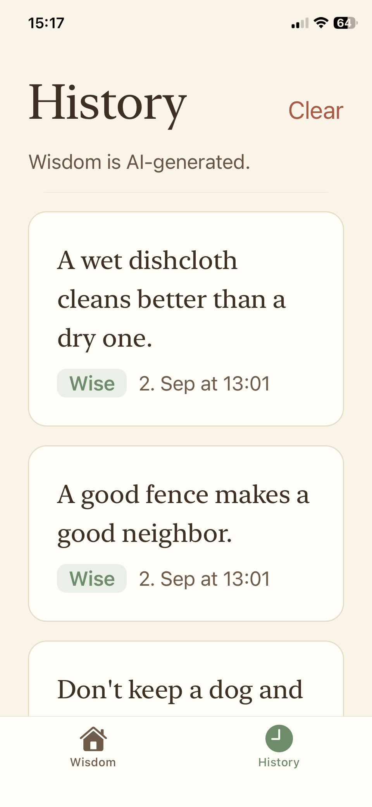

# Grandma's Wisdom of the Day

A small Expo Go app with one AI feature: tap a button, pick a mood, and Grandma
hands you a single line of wisdom.

> **The one-sentence brief:** I tap a button, pick Funny or Wise, and Grandma
> gives me one line of wisdom.

Built for Sprint 4 / Part 4 of the Turing College "Building with AI" course. The
AI call runs through [OpenRouter](https://openrouter.ai), and the key never
leaves the server side.

---

## What it looks like

| Wisdom | History |
| --- | --- |
|  |  |

## What it does

Two screens, one AI feature.

| Screen | What's on it |
| --- | --- |
| **Wisdom** (`/`) | A Funny / Wise toggle, an "Ask Grandma" button, the wisdom card, and the AI-disclosure line |
| **History** (`/history`) | Every piece of wisdom generated so far, newest first, with its mood and timestamp |

Nothing else. No accounts, no login, no server database.

## How it's wired

```
 phone (Expo Go)                    dev server (your laptop)              OpenRouter
┌────────────────────┐             ┌──────────────────────────┐         ┌──────────┐
│ app/(tabs)/        │  POST       │ app/api/wisdom+api.ts    │  HTTPS  │  chat/   │
│   index.tsx        │ ──────────► │                          │ ──────► │ completi │
│                    │ /api/wisdom │  reads OPENROUTER_API_KEY│         │   ons    │
│  { tone }          │             │  from process.env        │ ◄────── │          │
│                    │ ◄────────── │                          │         └──────────┘
│  { wisdom }        │   JSON      └──────────────────────────┘
└────────────────────┘
```

The key lives in `.env` on the laptop, is read by `process.env` inside the API
route, and is used only there. It is never imported into a component, never
prefixed with `EXPO_PUBLIC_`, and therefore never ends up in the JavaScript
bundle that Expo Go downloads to the phone.

**This means the app only works while `npx expo start` is running.** That is
correct and intended for this project: it is a live preview on your own phone.
Shipping it to other people would mean deploying that API route somewhere, which
is out of scope here.

## Project layout

**Expo SDK 54, pinned deliberately** — that is the newest SDK the target
iPhone's Expo Go can load. Do not upgrade it; a newer SDK makes the app
unopenable on that device.

```
app/
  (tabs)/
    _layout.tsx        tab bar
    index.tsx          the wisdom screen
    history.tsx        the history screen
  api/
    wisdom+api.ts      server route — the ONLY place the key is touched
  _layout.tsx
constants/
  theme.ts             colours, spacing, type scale
lib/
  api.ts               builds the dev-server URL for the phone to call
  history.ts           AsyncStorage read/write helpers
.env                   your key (git-ignored, never committed)
.env.example           the shape of .env, with no real values
app.json               note web.output = "server" — API routes need it
CLAUDE.md              the pinned server-side-key rule
CHECKLIST.md           build + review checklist
```

## Setup

You need [Expo Go](https://expo.dev/go) on your phone and an OpenRouter account
with a few dollars of credit (~$5 is plenty).

```bash
npm install
cp .env.example .env     # then paste your key into .env
npx expo start
```

Scan the QR code with Expo Go (Camera app on iOS, the Expo Go app on Android).
Phone and laptop must be on the same Wi-Fi.

**Watch the port Expo prints.** It uses 8081 by default but falls through to
8082 or higher if something already holds it — a stale Metro process from an
earlier session is the usual culprit, and it can survive closing the terminal.
The app itself doesn't care, but any `curl` test against the API route has to
use the port actually in use.

### Environment variables

`.env`, git-ignored, never committed:

```
OPENROUTER_API_KEY=sk-or-v1-...
OPENROUTER_MODEL=google/gemini-2.5-flash
```

`OPENROUTER_MODEL` is optional — the route falls back to the same default.
Change it here to swap models without touching code, then **restart the dev
server**: `.env` is read at startup, so an edit alone has no effect.

Two things learned by measuring rather than guessing:

- **The model was not the problem; the prompt was.** Early output tacked an
  explanation onto every line ("...and you'll find joy in the journey"), which
  is the clearest tell of a machine. The prompt had asked for "one or two short
  sentences"; asking for exactly one, with examples of the target register and
  an explicit ban on trailing `and`/`so`/`because` clauses, fixed it on the
  original cheap model. Only then was a model comparison worth running.
- **Reasoning models need far more `max_tokens`.** `openai/gpt-5-mini` returns
  HTTP 200 with empty content at `max_tokens: 60`, having spent the whole
  budget reasoning before writing a word. If you swap to a reasoning model,
  raise the cap or you will get silent empty replies.

Note the deliberate absence of an `EXPO_PUBLIC_` prefix on either variable.
That prefix would inline the value into the app bundle, where anyone who
installs the app could read it back out.

### If the phone won't connect

From the mobile taster lesson, in order:

1. Set your Wi-Fi network to **Private** in Windows settings.
2. Allow **Node.js** through the Windows Defender firewall (both private and
   public).
3. Fall back to tunnel mode: `npx expo start --tunnel`.
4. Check the SDK. This project is pinned to **SDK 54** because that is what the
   target iPhone's Expo Go supports. If Expo Go says the project is
   incompatible, the pin is wrong for your device, not the app.

If the app loads but the AI call fails on device while `curl` against the dev
server works, check the port first — Expo falls through to 8082 or higher when
8081 is taken, and the phone will be pointed at whichever one Expo printed.
`lib/api.ts` already builds an absolute URL from `Constants.expoConfig.hostUri`,
so a relative-fetch problem is not the cause.

## Security

The one rule that genuinely matters here: **the OpenRouter key stays off the
phone.**

- The key is read with `process.env.OPENROUTER_API_KEY` inside
  `app/api/wisdom+api.ts` and nowhere else.
- No `EXPO_PUBLIC_` variable holds a secret.
- `.env` is in `.gitignore` from the first commit and appears nowhere in git
  history. Worth knowing: the Expo template ships only `.env*.local`, which does
  **not** match a plain `.env`. That line was added by hand and verified with
  `git check-ignore -v .env`.
- `CLAUDE.md` pins this rule so it survives future changes.

### Verification

An agent security review (Claude Code's `/security-review`) reported **no
qualifying vulnerabilities**, having confirmed the key cannot reach the client
by any path: direct import, `EXPO_PUBLIC_` prefix, bundler inlining, or being
echoed in a response or error. It raised one non-security nit — `in` walking the
prototype chain in the tone check — which is fixed.

Alongside it, these checks were run and all came back clean:

| Check | Result |
| --- | --- |
| `.env` in any commit, full history | Absent |
| `sk-or-*` in any tracked blob, all refs | Absent |
| The real key value across all history | Absent |
| Key in the exported client bundle | Absent — `OPENROUTER` appears 0 times in `dist/client/` |
| Key baked into the server bundle | No — reads `process.env` at runtime |
| `EXPO_PUBLIC_` holding a secret | None |

The bundle check is the one that matters most: `dist/client/` is exactly what a
phone downloads, so a key absent from it is a key that cannot be extracted from
the installed app.

## AI transparency

Both screens that show AI output carry this line:

> Wisdom is AI-generated.

It sits **above** the output on each, not below it. That ordering is
deliberate: a label placed after the thing it labels can be scrolled past
unseen, and on the History screen it originally was — it had been a
`ListFooterComponent`, rendering after up to 100 generated entries. A
compliance audit caught that; it is now fixed in the screen header, visible
before any entry. Each history row also announces itself as AI-generated to a
screen reader, so a VoiceOver user swiping row by row hears it every time
rather than once.

The line is never behind a modal or a settings page, and it renders whether or
not any wisdom has been generated yet.

This addresses the **visible-disclosure** side of the **EU AI Act, Article 50**
duty. The other side, machine-readable marking of synthetic content under
Article 50(2), falls on the provider of the model rather than on a deployer
calling it — so it is not addressed here beyond an `aiGenerated: true` field on
the API response and each stored entry, which is a cheap hedge rather than a
claim of compliance. If this route were ever deployed publicly under its own
name, that question would need revisiting.

## Optional tasks completed

- **Polished for the phone** — warm calm palette (cream, deep brown, one sage
  accent), 18–20px body text, generous spacing, the wisdom set as a large quote.
- **Loading indicator** — "Grandma is thinking…" with a spinner while the call
  is in flight, so the screen never looks frozen.
- **History screen** — a second screen listing every answer generated so far,
  persisted locally with AsyncStorage.
- **Secret-leak scan** — repo and full git history scanned to confirm the key
  was never committed, plus the exported bundle checked directly. Results in
  the Verification table above.
- **Spending cap** — **$1 per week** on the OpenRouter key.

That cap is necessary rather than optional. `/api/wisdom` has no
authentication, and the Expo dev server binds every interface, so anyone on the
same Wi-Fi can POST to it and spend the credit, in a loop if they like. Tunnel
mode (`npx expo start --tunnel`) puts the same endpoint on the public internet.
Adding auth is out of scope for a local preview, so the cap is what bounds the
damage. At roughly $0.00018 a call it still allows about 5,500 taps a week —
well past any genuine use, while capping a runaway at pocket change.

Not attempted: the in-app model picker (the model is swappable via `.env`
instead).

## Reviews

Three independent reviews were run over the finished app. All findings were
acted on; the list below records what each one caught, including the things it
caught in this README.

### Security review — clean

No qualifying vulnerabilities. It confirmed, with line citations, that the key
cannot reach the client by any path: it is read once inside the `+api.ts` route
(which Metro excludes from the client graph), no `EXPO_PUBLIC_` secret exists so
bundler inlining cannot apply, no client module imports the route, and every
failure path returns a fixed string with the upstream error body going only to
the server log. It also confirmed `lib/history.ts` does no object merge, spread
or `JSON.parse` reviver, so stored data cannot become a prototype-pollution
gadget.

### EU AI Act audit — Limited risk, one failure found and fixed

Classified as **limited risk (transparency-only)**: not prohibited under
Article 5, and outside every Annex III high-risk domain, since the output is a
one-line aphorism attached to no decision, score or eligibility outcome.

It found a real failure. The History screen's disclosure was a
`ListFooterComponent`, which renders *after* the last row — so with history
capped at 100 entries, a reader could scroll past dozens of machine-written
lines and never reach the label. The disclosure existed but did nothing on that
screen. Both screens now place it above the output, each history row announces
itself as AI-generated to a screen reader, and the disclosure has an accessible
colour. It also caught three overstatements in these docs, all corrected.

### Code review — 11 findings, all fixed

The two that mattered most:

- **The error handler hid the most likely first-run failure.** A missing key
  returns a clear 500 saying so, but the screen discarded it and showed
  "Grandma couldn't be reached. Try again in a moment." — sending a user who
  forgot to paste their key into an endless retry. Server-supplied errors are
  now shown; the generic line is kept only for genuine network failures.
- **The contrast fix had been applied to one label out of five.** `textMuted`
  measured 3.78:1 and was also the colour of the subtitle, empty state, radio
  hints and history timestamps. It is now 5.89:1, so the whole secondary type
  scale passes AA rather than just the disclosure.

The rest: the root layout still followed the system colour scheme in a
light-only app, which put white status-bar glyphs on a permanently cream
background; `app.json` still carried the template's blue and black launch
colours; a failed request left the previous answer on screen beneath the error;
`Alert.alert` is a no-op on web, so Clear silently did nothing there; the
disclosure I had just moved was labelling an empty history list; and eight
template files formed an unreachable island, now deleted along with the
light/dark `Colors` table they used.

`expo-image`, `expo-web-browser` and `expo-font` are left installed despite
being unused by app code — pruning SDK packages risks breaking autolinking for
no benefit here.

## Choosing the model

`google/gemini-2.5-flash` is the default, picked by running the same prompt
through four models three times per tone:

| Model | Verdict |
| --- | --- |
| `openai/gpt-4o-mini` | Workable, but reaches for tired templates |
| `anthropic/claude-haiku-4.5` | Best funny lines; repeated a wise line verbatim |
| `google/gemini-2.5-flash` | Strongest on both tones — **chosen** |
| `openai/gpt-5-mini` | Unusable here: empty replies, see the note above |

At roughly 350 tokens in and 30 out per call, Gemini 2.5 Flash costs about
$0.00018 a call — around 5,500 taps per dollar.
