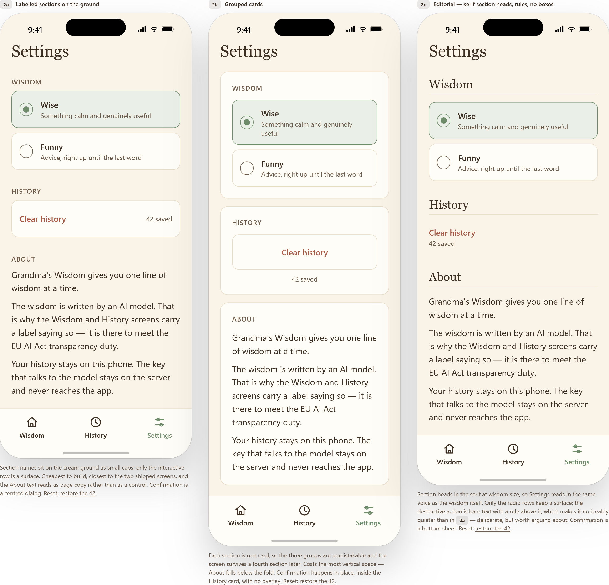
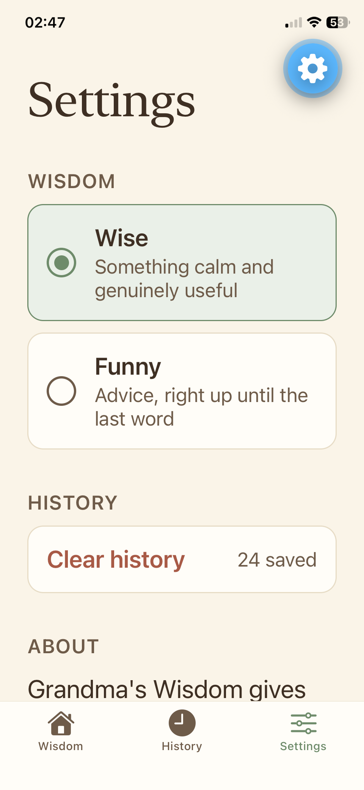

# Part 5 — Claude Design and multitasking

Coursework for Sprint 4 / Part 5 of the Turing College "Building with AI" course.

Unlike the earlier parts, this one has no single lab at the end. It covers several
loosely connected topics and hides **two** graded pieces of work in the middle of
a lot of walkthrough. This folder holds the write-up and evidence for those two,
plus one optional extra we chose to do.

The app being designed for is **[Grandma's Wisdom of the Day](../part4)** — the
Expo app built in Part 4. The screen itself is built there; this folder holds the
notes, prompts, rationale and screenshots.

Progress is tracked in **[CHECKLIST.md](./CHECKLIST.md)**.

---

# Task 1 — Design a new screen and hand it off ✅

**Done.** A Settings screen designed in Claude Design against the app's real
tokens, handed off as a bundle rather than a screenshot, built on a branch,
reviewed, verified on a phone, and merged.

| The design (2a of three) | The built screen |
| --- | --- |
|  |  |

The evidence, in the order it was produced:

| File | What it holds |
| --- | --- |
| [`docs/prompts.md`](./docs/prompts.md) | The goal / layout / content / audience prompt, written **before** opening the tool |
| [`docs/design-sync-findings.md`](./docs/design-sync-findings.md) | Why `/design-sync` refuses this repo, verbatim, twice |
| [`docs/design-system/style-guide.html`](./docs/design-system/style-guide.html) | The design system, extracted by hand from `theme.ts` and the screens |
| [`docs/design-log.md`](./docs/design-log.md) | Three variations, why 2a won, and the design measured against the built screen |
| [`docs/handoff-prompt.md`](./docs/handoff-prompt.md) | The Share → Claude Code prompt, verbatim, and what it did and did not carry |
| [`docs/design-system/exports/`](./docs/design-system/exports/) | The exported canvas, self-unpacking, all three artboards |

## What actually happened

### The documented route does not exist for this repo

`/design-sync` is a React → browser converter. It wants Storybook or a bare
component package that compiles to a bundle a browser can render. This is an
Expo app with its UI written inline in three screens, and it refused — correctly.
Four gaps, in increasing order of difficulty: no shared component layer, no
library build, React Native primitives instead of DOM, and TypeScript token
objects instead of CSS.

Closing them would mean a second bundler, a web build target aliasing
`react-native` to `react-native-web`, and a CSS token generator — and it would
make `Platform.select` in `constants/theme.ts` resolve to the *web* branch, so
the design tool would see web font stacks instead of the iOS `ui-serif` the app
actually renders. The design system would be subtly wrong in exactly the way
that is hardest to notice. We took Option B (upload existing brand material)
instead, and recorded the refusal rather than skipping it silently.

**But React Native is the smaller half of the reason, and framing it that way
undersells the finding.** The requirement that actually generalises is the
component library. `/design-sync` publishes a design system you *already have*,
expressed in code as a catalogue of reusable parts. It does not create one.

Nothing in this sprint could feed it:

| Part | What it is | Readable by `/design-sync`? |
| --- | --- | --- |
| 1 | PDFs, diagrams, a deck | No — not code |
| 2 | Markdown findings | No — not code |
| 3 | An Expo app, SDK 54, **no `components/` directory at all** | No |
| 4 | This Expo app | No |
| 5 | Documentation | No |

No `.storybook` and no `*.stories.*` anywhere in the repository. Part 3 is the
instructive one: set React Native aside entirely and it still fails, on the
catalogue requirement alone.

So the circularity is the real finding. **The prescribed first step requires the
thing the exercise exists to teach you to produce.** A Python project fails it.
A hand-written HTML site fails it. Any project without a mature front-end fails
it — which is nearly every coursework project, and a good share of real ones.

**Where the course text genuinely falls short**, stated narrowly now that the
GitHub claim has been withdrawn:

- **It never mentions React Native.** `/design-sync` is documented as needing
  *"JavaScript/TypeScript component libraries (React, Vue, Svelte, JSX)"*. This
  repo is TypeScript and React. It reads as supported and is not, because React
  Native's components do not render in a browser. That is an easy trap and the
  text does nothing to flag it.
- **The troubleshooting table misdiagnoses our case.** It maps the
  missing-component error to *"Non-JS/TS codebase structure"*, with the fix
  *"Use Option A or Option B import routes"*. The remedy is right; the cause is
  wrong. Ours is a JS/TS codebase with no component library, which the table does
  not describe.
- **The exercise suggests the project type that cannot satisfy its own first
  success criterion.** It invites you to pick an existing project, naming a
  *"mobile interface"* as an option, makes `/design-sync` the unconditional Step
  1, and then requires *"design system created in Claude Design from actual
  codebase components"*. For an Expo app — and this course has you build two —
  those cannot all be true at once.

None of that is contradicted by the GitHub correction. The routes were
documented; the precondition for the *prescribed* route was not.

### Uploaded brand material beats an attached design system

The create flow forces you to pick a preset theme before it accepts anything,
which produced a design system called **Organic** — terracotta, Caprasimo over
Figtree, nothing to do with this app. It was attached to the canvas *and
comprehensively ignored*: not one hex from its palette appears in any of the
three artboards. The tokens came from the uploaded style guide sitting beside it.

Worth knowing before the next project. The theme you are forced to choose is a
formality when you are bringing your own tokens, and the design system it creates
is then overridden by the thing you upload next to it.

### The route we should have used was in the menu the whole time

**Connect GitHub.** Not the CLI converter — a separate option in the project
creation menu, under *Code*, described as *"connect a codebase for Claude to
design within."* We used *Attach file* and uploaded a hand-written style guide
instead. Tested afterwards, out of curiosity, and it should have been the
inbound route from the start.

Pointed at this repo and asked to report the design tokens **and name the file
each value came from**, it went straight to `part4/constants/theme.ts` and read
it correctly. Every colour, the full type scale, the spacing scale — right,
cited, and derived from the React Native source rather than from the notes
sitting one folder away in `part5`.

It also caught, unprompted:

- the hardcoded `#F5E7E2` in `history.tsx`, and that it violates the project's
  own no-hex-in-screens rule
- that radii are not tokenised — 14, 16, 8, 13/7 as literals
- **that the fonts are conditional.** `Platform.select` gives `ui-serif` on iOS
  and the Georgia stack on web, so the serif depends on the target. This is the
  one thing I had predicted it would miss, and the specific trap the hand-written
  guide existed to cover.
- things the guide did *not* have: font weights are literal `'600'` rather than
  tokenised, body text sets no family at all and falls through to the platform
  font, and the vertical padding is a runtime value from the device's safe-area
  insets rather than a fixed number.

**Why it did so well is worth understanding.** It was not inferring from the
code alone — it was reading the *comments*. It quoted `theme.ts` on why
`textMuted` was raised from a failing 3.78:1, and `settings.tsx` on why the
disabled row swaps colour instead of fading. Well-commented code turns out to be
machine-readable design documentation, which is a better argument for writing
comments than any I had before.

**What the hand-written guide still added.** It reports contrast the code does
not document. The model repeated every ratio that appears in a comment and
computed none that do not — so `accentText` on `accent` at 3.77:1 and the two
tone pills at 3.26:1 and 4.13:1 went unmentioned, along with the instruction not
to propagate them. It reads what the code *says*, including its comments. It
does not audit what the code does.

So the right answer was **both**: connect the repo for the values, supply the
guide for the judgement about them. Not one instead of the other.

**It is in the assignment, and we missed it.** An earlier draft of this file
claimed the course text omitted the GitHub route. It does not. Re-reading the
text against this write-up, it appears twice, and the second time inside the very
option we chose:

> **Option B: upload a brand you already have.** Choose *Create here* to import
> existing brand materials. Supported formats include:
> **Connected tools: Figma links, GitHub repositories** · Codebases: Existing UI
> packages and style guides · Design files · Documents · Assets

So Option B offered two sub-routes — connect a repository, or upload files — and
we took the second and never read the first line of the list. The text even
carries the guidance we needed for it: *"For large codebases, attach front-end UI
subdirectories instead of repository roots"*, which is exactly the "scope it to
`part4`" problem we hit when testing it afterwards.

That reclassifies the finding. It is **not** an omission in the material. It is
our miss, in a list we had read, in the option we had already selected. The
material's actual gap is narrower and sits elsewhere — see below.

**The mistake underneath this one is the generalisable part.** Asked whether a
GitHub link would have worked, I said no — reasoning from how `/design-sync`
behaves to how a differently-purposed feature would behave, without checking
that the second feature existed. It was in the menu. The lesson is narrow and
sharp: *a tool refusing one route is not evidence about its other routes.*

### The bundle carried structure and tokens, and nothing else

This is the part that justifies the whole exercise, and the part that
disappointed.

**What survived intact.** Every colour, size and gap. Measured off the exported
2a markup against `constants/theme.ts`: `#FAF4E8`, `#FFFDF8`, `#E7DCC6`,
`#3E2F23`, `#6E5B49`, `#6E8B6A`, `#A85A46` — exact. 34 / 25 / 18 / 17 / 14px
type — exact. 10 / 16 / 24 / 36px spacing — exact. Radius 14 and the 26 / 13 / 7
radio geometry — lifted from `index.tsx` and returned unchanged. The copy came
back word for word, including the strings we asked it not to reword. A screenshot
handoff would have made the agent guess at every one of those.

**But what the bundle is *worth* depends on what you are building, and the course
text does not say so.** The export is web code — HTML with inline styles, plus a
device frame and a runtime. For a web project that is nearly usable output: same
technology as the app, adapt rather than re-derive. For us it was a
**specification**. Every value transferred exactly and every line still had to be
rewritten in React Native's vocabulary — `View` for `div`, `StyleSheet.create`
for CSS. "The bundle beats a screenshot" is true here, by a narrower margin than
the intended audience gets: we received a precise spec, a web team receives a
running head start.

**What did not travel — corrected.** An earlier version of this section said the
custom-instructions field did not carry its contents. That was wrong, and the
evidence was in our own handoff prompt: the line `Implement: Use layout 2a.` *is*
the custom instruction, typed into that field and duly carried across. The field
works.

What actually happened is that the constraints — reuse the existing components,
do not touch Wisdom or History, keep the key server-side — were drafted and then
never entered; a shorter instruction was typed instead. So they had to be
restated by hand in the session, and that was our doing, not the tool's.

The narrower claim that survives: a handoff bundle carries what you put in it,
and nothing about a project's rules travels unless someone types it. `CLAUDE.md`
remained the thing actually carrying them, which is why it was extended before
the build rather than after — but that is an argument for project rules living in
the repo, not evidence of a missing feature.

**The bundle we received was thinner than the documented one.** The text lists
the handoff package as containing HTML/CSS/JS layout code, component hierarchy,
exact tokens, rendered state previews, *screen annotations and chat decision
logs*, and a *handoff README detailing recommended stack conventions*. Reading
the project through the tool afterwards, there is no README in it — the files are
the canvas document, the device frame, the runtime and the uploads. And no
annotations existed to travel, because none were made (see *Where this fell
short*). So two of the seven documented contents were absent, one because the
tool did not produce it and one because we did not create it.

**The selection genuinely could not be scoped.** The canvas offered no way to
share a single artboard, so the handoff points at the whole document and the
choice rides on the same hand-typed line: `Implement: Use layout 2a.` This one is
the tool's doing, not ours — there was no control to use. The mechanism meant to
carry a selection did not exist; prose carried it.

Two things in the design were also *not* inherited from the code and were
therefore decisions rather than transfers: the `.06em` letter spacing on the
section labels (no token exists — it became `0.84px`, because React Native takes
points and cannot track font size), and using `Fonts.serif` for a screen title,
which no shipped screen did before.

### The loop does not close, in either direction

The course text presents the return sync as routine: *"Execute `/design-sync` to
push updated codebase states back to Claude Design."* On this repo, neither route
works — and trying both **fragments** the design system rather than converging it.

| Route | Outcome |
| --- | --- |
| `/design-sync` → the design system | Refuses. Same four gaps. A third screen did not change anything. |
| Browser upload of brand material | Succeeds, and creates a **new project every time**. Not an update mechanism. |

Three projects now exist where one was intended, and the sharpest way to put it
is this: **the design system is the only one of the three that has never held
this app's tokens.**

| Project | Type | Holds |
| --- | --- | --- |
| `Organic` | design system | the preset's terracotta tokens, untouched since creation |
| `Grandma's Wisdom mobile app` | project | the canvas, `Organic` attached and ignored, the *Phase 2* style guide |
| `Mobile app design scope` | project | the *current* style guide and all three screenshots |

The newest upload is the only place with the shipped values and the one place
nothing is attached to. That is not a workflow, it is an accumulation.

The regenerated guide was verified as having arrived complete and correct — the
new section-label and destructive-row components, the three new contrast
measurements, the re-triaged inconsistencies table. It simply arrived somewhere
that nothing reads.

**Not worked around.** Writing the guide into the design system directly through
the `DesignSync` tool would have succeeded — it is writable. It was not done:
the skill records that its workflow is reserved for explicit user invocation and
must not be reproduced by other means, and hand-rolling a sync to route around a
sync that refused is exactly that. A design system populated by an agent
bypassing the tool is not the round trip this exercise is testing.

### Did the second sync change anything?

No, and that is the answer the checklist asked for. It refused again on the same
four gaps, created nothing, and adding a third screen moved none of them.

Recorded as **confirmed on re-inspection, not independently reproduced** — the
second run read the existing findings and honoured the prior decision rather than
re-deriving it. It did real work on top: re-verified the gaps against the current
repo, found the Storybook absence itself, and caught two facts that had gone
stale. But calling that a second test from scratch would overstate the evidence.

It also surfaced two things worth keeping:

- **The pressed-opacity drift closed itself.** `0.85` on one screen and `0.6` on
  the other became one value — not because anyone fixed it, but because the `0.6`
  copy lived on History's Clear button and Settings took that button over. There
  is still no token, so a third copy would diverge the same way. Convergence by
  luck, not by structure.
- **The `<Disclosure />` extraction is now unclaimed rather than deferred.** It
  was held back to avoid widening the Settings task; that reason expired at the
  merge. Still defined twice, still with different alignment.

### What the agent got wrong

Written down because "the build went fine" is not a finding. All of these were
caught by `/code-review` on the branch, before merge:

- **The disabled row faded *and* recoloured**, while the comment above it claimed
  only the colour swap. The two stacked, taking the "Nothing saved yet" line from
  6.35:1 to roughly 3:1 — and that line is the only thing explaining why the row
  is inert. The worst of the five, because the comment asserted the opposite of
  what the code did.
- **Clearing assumed it succeeded.** `clearHistory()` swallows its storage
  failure and resolves either way; the count was set to zero regardless. A failed
  write would have shown "Nothing saved yet" over a History tab still listing
  everything.
- **A race the comment claimed to prevent.** The stored default is read
  asynchronously, so a tap landing first was silently overwritten — precisely the
  failure the comment above it said it was avoiding.
- **`accessibilityState.selected` without `checked`**, so the radio rows were
  never announced as checkable. Copied from the Wisdom screen, where the same bug
  had been sitting unnoticed. Both are fixed now.

One finding was rejected: the review read the cold-start-only default tone as a
defect. It is the specified behaviour — Settings decides what is checked when the
app opens, the picker on the Wisdom screen decides what that request asks for.

### The design matched the build everywhere except the fold

On a phone, the hint lines under Wise and Funny wrap to two lines where the
design showed one, every radio row grows, and the About section ends up below the
fold. Almost certainly a device-width difference: the design frame was 402pt, a
current-generation iPhone, and the test device is older and narrower.

Left alone — the screen scrolls, About is reference text, and narrowing the
design to the smallest phone in circulation would be optimising for the test
device. But it cost an argument: *"2b pushes About below the fold"* was one of
four reasons 2a won, and on hardware 2a does it too. The honest version is that
2a fits more above the fold, not everything. **Any argument resting on what sits
above the fold is an argument that moves with the phone.**

## What we got wrong

Corrections are marked inline where they belong, but scattering them makes them
easy to miss, so they are collected here too. Everything below was asserted in
this folder and later disproved — twice by re-reading the assignment, once by
re-reading our own evidence.

| Claimed | Actually |
| --- | --- |
| The course text omits the GitHub route | It lists it twice, the second time as the first supported format under Option B — the option we chose |
| The custom-instructions field does not carry its contents | It does. `Implement: Use layout 2a.` in our own handoff prompt *is* the custom instruction |
| A GitHub link would not have helped | It would have. Pointed at the repo it read `theme.ts` correctly, and found things the hand-written guide missed |
| The cold-start-only default tone was a defect | It is the specified behaviour — the review that flagged it did not have that context |
| Pressed-opacity drift was fixed | It was deleted by accident during unrelated work. Nothing was fixed |

**Three of the five are the same error**: reasoning confidently from one piece of
evidence to a conclusion it did not cover. `/design-sync` refusing was treated as
evidence about a different feature. A drafted instruction was assumed to have
been sent. A refusal message was allowed to stand in for the whole assignment
text.

The correction came each time from going back to the primary source — the menu,
the prompt, the course text — and never from re-reading our own reasoning. That
is the part worth carrying forward: rechecking an argument tends to confirm it,
and rechecking its source does not.

**The git history is not corrected**, and honestly cannot be. Commit `acee1ae`
and its predecessors assert the GitHub omission and the custom-instructions claim
as fact; `750bc47` withdraws both. The wrong versions stay where they were
written, which is what a history is for.

## Where this fell short

- **Phase 4 barely happened.** Of the four refinement mechanisms, only chat was
  used. No inline comments, no Tweak controls, and the one direct canvas edit was
  made on a state that never became the final export. No annotations were added
  to the canvas at all, so the course success item for them is marked not met.
- **That omission has a visible cost.** Annotations are the mechanism that would
  have carried the pressed / disabled / empty states into the bundle. They were
  specified anyway — in `prompts.md`, before designing — and implemented. But
  they travelled in a markdown file rather than in the handoff, which is the
  refinement phase's whole purpose: it is where a design stops being a picture
  and becomes a specification.
- **The usage baseline was never recorded**, so the before/after comparison this
  folder planned cannot be made honestly. Marked as such rather than estimated.
- **We used the wrong inbound route, and only found out afterwards.** *Connect
  GitHub* was offered in the same menu we used to attach a file. Nobody looked
  at the other entries. The result was still accurate, so nothing downstream is
  wrong — but the hand-transcription step was avoidable work, and finding that
  out required a test run after the deliverable was already closed.

---

# Task 2 — An independent verifier on an open-weight model

**Not started.** Not blocked either.

Configure the **standalone Codex CLI** to run an open-weight model through
OpenRouter, then use it to adversarially review code Claude Code wrote.

The reasoning is single-point-of-failure: if your builder and your reviewer are
the same model family from the same vendor, they share blind spots, and an access
change at that vendor takes out both at once. Claude Code builds, an open-weight
model on OpenRouter checks — different family, different provider, weights that
stay downloadable regardless.

Task 1 has left it a good target: the Settings branch is merged, and the five
findings `/code-review` produced are a benchmark. A second reviewer that finds
none of them tells you something; one that finds a sixth tells you more.

# Task 3 — The `codex-plugin-cc` plugin

**Not started.** Optional, and being done because the key already exists.

OpenAI's plugin exposes `/codex:*` slash commands inside Claude Code — notably
`/codex:adversarial-review`. Not the same thing as Task 2: the plugin runs
OpenAI's models from inside Claude Code, Task 2 runs an open-weight model from a
separate terminal. Doing both gives three independent reviewers on the same diff.

## Skipped on purpose

| Skipped | Why |
| --- | --- |
| The CV walkthrough in Claude Design | A tutorial with no success checklist. Task 1 exercised the same tool on something that mattered more. |
| Git worktrees | The text itself says leave them alone at first — one agent per project is the habit worth building. |
| Parallel-session practice as a *deliverable* | It is a working habit, not something with an artefact. It happened while working — the second `/design-sync` ran in its own session — and is not documented as a deliverable. |

---

## How the risks played out

Predicted at the start, before any tooling was opened. Kept here because the
scoreboard is more useful than the predictions were.

| Risk | Outcome |
| --- | --- |
| `/design-sync` may not accept a React Native codebase | **Happened, exactly as described.** The predicted failure point was the failure point. The fallback named in advance — Option B — is what was used. |
| `part4` is mid-upgrade, SDK 54 → 57 | **Avoided.** Nothing touched `part4` until the upgrade landed and ran on the phone. |
| Claude Design is beta and needs Pro/Max | **Not the real gate.** It was available; the gate was `/design-login`, without which not even listing projects works. |
| Usage burn | **Not measured.** The baseline was never recorded, so this one cannot be answered either way. |
| Model slug `z-ai/glm-5.2` may not exist | Untested — Task 2 has not started. |
| `wire_api = "responses"` | Untested — Task 2 has not started. |
| Windows | Untested for Task 2. Irrelevant to Task 1. |

## Cost

| Thing | Who bills |
| --- | --- |
| Claude Design + Claude Code | Existing Claude plan allowance — shared, so design work eats coding budget |
| Open-weight model via OpenRouter (Task 2) | OpenRouter, existing key, spending cap already set |
| `codex-plugin-cc` (Task 3) | OpenAI, separately, on the existing key |
